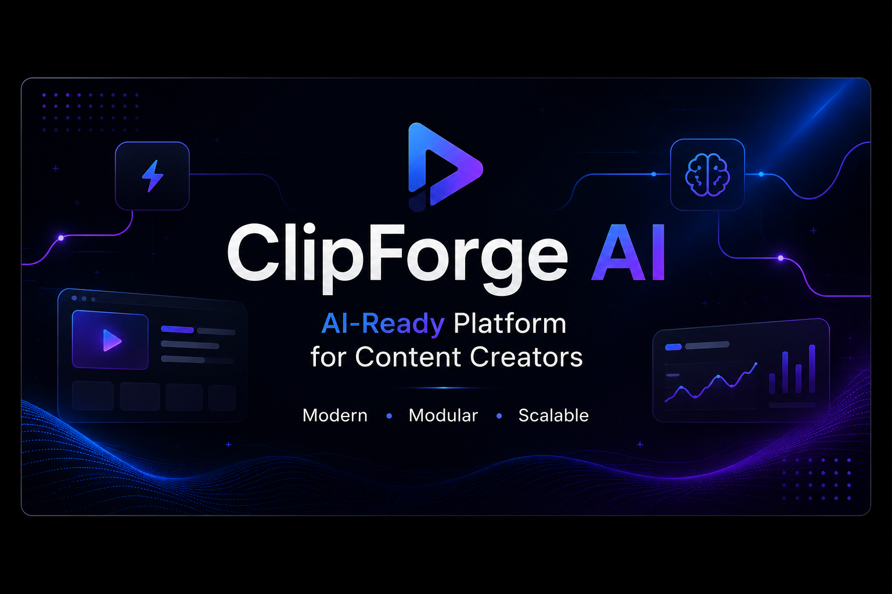
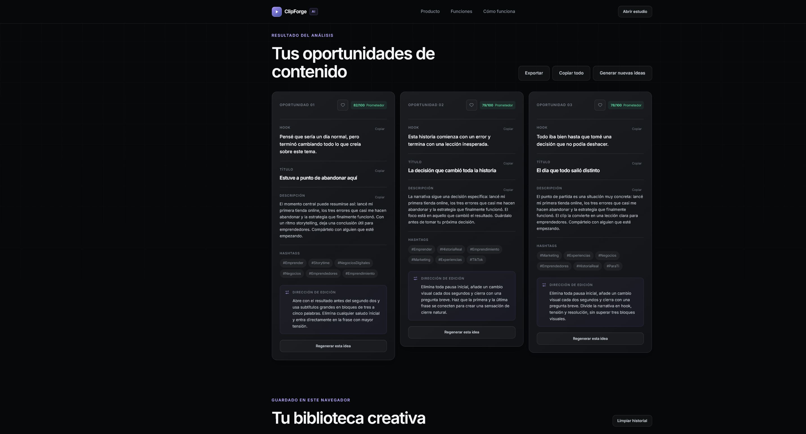
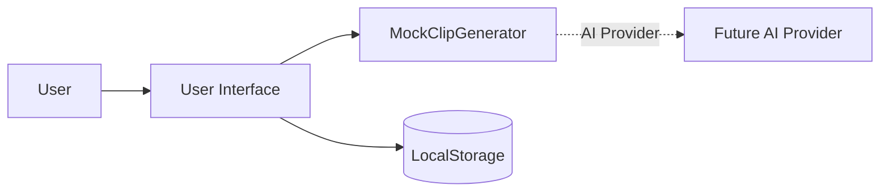

# ClipForge AI

<p align="center">
  
</p>


ClipForge AI is a modern SaaS-inspired web application built for content creators, streamers, and video editors.

It transforms long-form content descriptions into production-ready clip concepts by generating engaging hooks, titles, descriptions, hashtags, editing recommendations, and a viral potential estimate through a modular AI-ready architecture.

## 🚀 Live Demo

🌐 **https://yeis0nn.github.io/clipforge-ai/**

Experience ClipForge AI directly in your browser — no installation required.

## 📋 Project Information

| Property | Value |
|----------|-------|
| **Status** | 🟢 Active Development |
| **Version** | 1.0.0 |
| **Frontend** | HTML5, CSS3, JavaScript |
| **Architecture** | Modular & AI-Ready |
| **Deployment** | GitHub Pages |
| **License** | MIT |


> > The current version uses a simulated AI engine built with JavaScript. Its modular architecture is designed for seamless integration with real AI providers such as OpenAI in future releases.

## Why ClipForge AI?

ClipForge AI was created to explore how a modern SaaS application can be architected before integrating real artificial intelligence.

Instead of focusing solely on generating content, the project emphasizes clean architecture, modular design, scalability, and user experience. The current simulated AI engine can later be replaced with real AI providers such as OpenAI without requiring changes to the user interface.

## Features

- Context-aware generation of three unique clip opportunities per analysis.
- Customization by platform, duration, style, and target audience.
- AI-inspired hooks, titles, descriptions, hashtags, and editing recommendations.
- Estimated viral potential score for each generated concept.
- Regenerate all results or individual suggestions.
- Persistent history and favorites powered by `localStorage`.
- Copy individual or complete results to the clipboard.
- Export generated content as TXT or JSON.
- Built-in example prompt and one-click workspace reset.
- Fully responsive, accessible interface with reduced-motion support.



## Tech Stack

- HTML5 semántico
- CSS3 modular
- JavaScript moderno con ES Modules
- Web Storage API
- Sin frameworks ni dependencias de JavaScript

## Project Structure

```text
clipforge-ai/
├── assets/
│   ├── icons/
│   └── images/
├── css/
│   ├── style.css
│   ├── components.css
│   ├── animations.css
│   └── responsive.css
├── js/
│   ├── app.js
│   ├── data.js
│   ├── generator.js
│   ├── storage.js
│   ├── ui.js
│   └── utils.js
├── tests/
│   ├── generator.test.mjs
│   └── storage.test.mjs
├── .nojekyll
├── index.html
├── LICENSE
├── robots.txt
├── site.webmanifest
└── README.md
```

ClipForge AI follows a modular, layered architecture that keeps presentation, application logic, content generation, and client-side persistence independent from one another. The UI communicates with a stable generation contract instead of relying on provider-specific implementation details, while storage concerns remain isolated behind a dedicated `localStorage` module.

`MockClipGenerator` acts as the current provider abstraction: it produces deterministic, AI-inspired results entirely in the browser while preserving the same boundary a production AI integration would use. In a future release, this implementation can be replaced by OpenAI or another AI provider without redesigning the interface or changing the user workflow.



## Running Locally

Because the project uses ES Modules, it must be served over HTTP rather than opened directly from the file system.

From the project root, run:

```bash
python -m http.server 4173
```

Then open:

```text
http://localhost:4173
```

Alternatively, you can use any static web server, such as the **Live Server** extension for Visual Studio Code.

## Testing

The project relies on Node.js' native test runner, eliminating the need for external testing frameworks or additional dependencies.

To run the test suite:

```bash
node --test
```

## Privacy

All descriptions, generated content, favorites, and history remain stored locally in the user's browser.

ClipForge AI does not include a backend, analytics, user tracking, or external data transmission. Your data never leaves your device.

## 🗺️ Roadmap

### ✅ Version 1.0 — Current Release

- Modern responsive interface
- Simulated AI generation engine
- Favorites and history
- Local Storage persistence
- TXT and JSON export
- Modular architecture
- GitHub Pages deployment

### 🚧 Version 2.0 — AI Integration

- OpenAI integration
- Secure backend architecture
- User authentication
- Saved workspaces
- Cloud synchronization

### 🔮 Future Vision

- AI transcript analysis
- Video content analysis
- Automatic clip recommendations
- Team collaboration
- Performance analytics dashboard

## License

Distribuido bajo la licencia MIT. Consulta [LICENSE](LICENSE).
